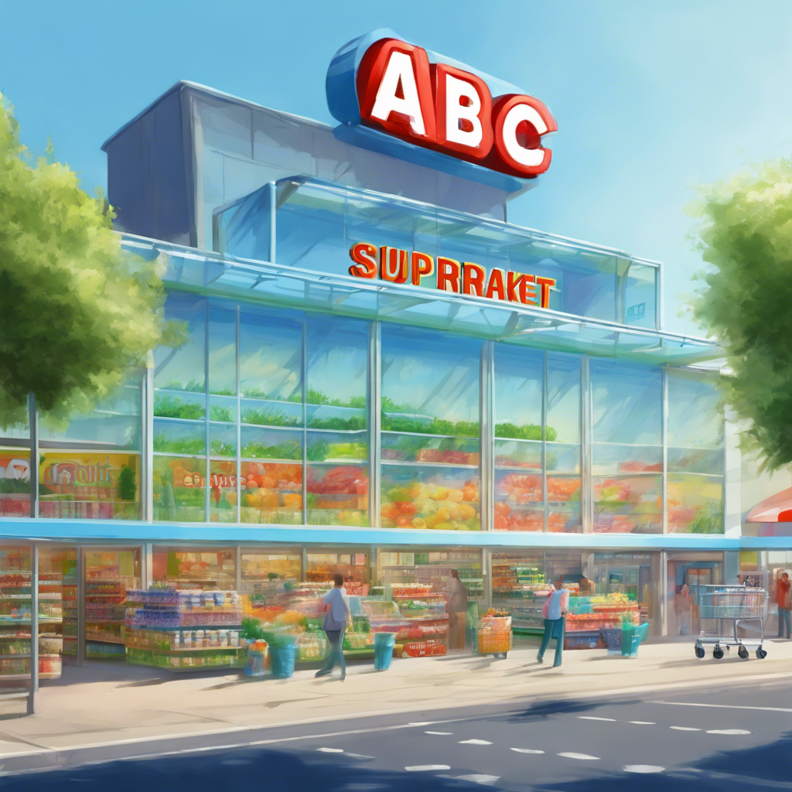



# Supermarket Customer Analysis

This project is part of the capstone projects from the Data Science and Machine Learning course at Purwadhika Digital Technology School. The notebook demonstrates the implementation of various data processing and machine learning techniques to analyze customer data from a supermarket.

## Description

The project involves analyzing customer data from Supermarket ABC to understand buying behavior and develop strategies to increase sales. It covers data preprocessing, exploratory data analysis, customer segmentation, and evaluation of promotional strategies.

### Business Context

The retail industry, particularly the supermarket sector, faces significant challenges due to changing consumer behavior and preferences, especially with the rise of e-commerce. Understanding customer behavior and preferences is crucial for supermarkets to remain competitive. This project aims to leverage customer data for better decision-making and strategy development.

### Business Task

Supermarket ABC aims to increase sales by product category through a better understanding of customer buying behavior. The specific objectives are:
1. Identify the best-selling product categories.
2. Understand the factors influencing purchasing decisions by product category.
3. Analyze customer patterns based on product category purchases.
4. Evaluate the effectiveness of current promotions and develop strategies to increase sales.

The analysis covers customer data from July 2012 to June 2014, focusing on purchasing behavior, promotion effectiveness, and customer segmentation. The goal is to achieve an increase in sales of specific product categories by at least 15% within the next year and improve promotion conversion by 10% compared to the previous period.

## Installation

To get this project, you can clone it by running the following code:

    git clone git@github.com:ikhza25/Capstone-Project-satu.git

## Project Organization

The directory structure of project looks like this:

    ├── README.md                   <- The top-level README for developers using this project.
    │
    ├── docs                        <- The document will consist of a detailed presentation or images.
    │
    ├── Capstone2.ipynb             <- Python Notebook for The Project.
    │
    ├── Supermarket_customer.csv    <- Dataset from this project.
    │
    └── requirements.txt            <- The requirements file for reproducing the analysis environment, e.g.
                                       generated with `pip freeze > requirements.txt`
                                       

## Tableau Visualization

For interactive visualizations and deeper insights, you can explore the Tableau dashboard here:

<a href="https://public.tableau.com/views/SupermarketCustomerDashboard_17227984570880/SupermarketCustomerDashboardMenu?:language=en-US&:sid=&:redirect=auth&:display_count=n&:origin=viz_share_link">Tableau Dashboard</a>

## Contribute

If you'd like to contribute, feel free to contact me here:

  
